# Cleaning Service Module ERD Plan

## Shared tables

This module uses shared tables from `shared_tables_erd.plan.md`:

- global: `users`, `cancellation_policies`
- worker infrastructure: `workers`, `worker_zones`, `worker_availability`, `worker_trust_logs`
- guided/pricing helpers: `property_type_configs`, `service_addons`, `travel_cost_configs`, `cleaning_financial_settings`
- booking protocol: `booking_reviews`, `booking_status_logs`, `booking_security_codes`, `booking_extensions`, `disputes`, `dispute_messages`, `sos_alerts`, `system_alerts`
- bidirectional ratings: `worker_customer_ratings`
- automation: `cleaning_automation_rules`

## Excluded Scope

The cleaning ERD intentionally excludes:

- wallet schemas
- heatmap analytics schemas
- social integration schemas
- delivery dispatch schemas

## ERD Diagram

```mermaid
erDiagram
    users ||--o{ cleaning_bookings : "books"
    users ||--o{ event_bookings : "books event"
    users ||--o{ workers : "has worker profile"

    workers ||--o{ cleaning_bookings : "assigned to"
    workers ||--o{ worker_availability : "sets"
    workers ||--o{ worker_zones : "prefers"
    workers ||--o{ worker_trust_logs : "tracked by"
    workers ||--o{ worker_customer_ratings : "rates or is rated"

    cancellation_policies ||--o{ cleaning_bookings : "governs"
    cancellation_policies ||--o{ event_bookings : "governs"

    cleaning_services ||--o{ service_pricing : "priced by"
    cleaning_services ||--o{ cleaning_booking_service : "included in"
    cleaning_services ||--o{ event_booking_service : "included in"
    service_addons ||--o{ booking_addons : "addon type"

    cleaning_billing_policies ||--o{ cleaning_bookings : "governs"
    cleaning_billing_policies ||--o{ event_bookings : "governs"

    cleaning_bookings ||--o{ cleaning_booking_service : "contains"
    cleaning_bookings ||--o{ booking_addons : "has"
    cleaning_bookings ||--o{ cleaning_time_warnings : "warned by"
    cleaning_bookings ||--o{ worker_customer_ratings : "rated via"

    event_bookings ||--o{ event_booking_service : "contains"
    event_bookings ||--o{ cleaning_time_warnings : "warned by"

    cleaning_bookings ||--o{ booking_status_logs : "tracked by"
    cleaning_bookings ||--o{ booking_security_codes : "secured by"
    cleaning_bookings ||--o{ booking_extensions : "extends via"
    cleaning_bookings ||--o{ booking_reviews : "reviewed via"
    cleaning_bookings ||--o{ disputes : "disputed via"
    cleaning_bookings ||--o{ sos_alerts : "SOS from"
    cleaning_bookings ||--o{ system_alerts : "alerts"

    event_bookings ||--o{ booking_status_logs : "tracked by"
    event_bookings ||--o{ booking_reviews : "reviewed via"
    event_bookings ||--o{ disputes : "disputed via"

    booking_reviews ||--o{ disputes : "may open"
    disputes ||--o{ dispute_messages : "has"

    users ||--o{ worker_customer_ratings : "rates or is rated"

    cleaning_bookings {
        bigint id PK
        bigint customer_id FK
        bigint worker_id FK "nullable"
        bigint preferred_worker_id FK "nullable"
        bigint cancellation_policy_id FK "nullable"
        bigint billing_policy_id FK "nullable"
        string booking_number UK
        string status "enum CleaningBookingStatus"
        string property_type
        json property_details "nullable"
        decimal estimated_sqm "nullable"
        decimal estimated_hours "nullable"
        decimal address_latitude "nullable"
        decimal address_longitude "nullable"
        date scheduled_date
        time scheduled_time
        decimal total_hours
        decimal base_price
        decimal addons_total
        decimal travel_fee
        decimal cancellation_fee
        decimal total_price
        boolean terms_accepted
        datetime work_started_at "nullable"
        datetime work_finished_at "nullable"
        datetime started_travel_at "nullable"
        datetime arrived_at "nullable"
        datetime customer_confirmed_at "nullable"
        datetime cancelled_at "nullable"
        string cancellation_reason "nullable"
        string security_code "nullable"
        timestamps created_at
    }

    event_bookings {
        bigint id PK
        bigint customer_id FK
        bigint cancellation_policy_id FK "nullable"
        bigint billing_policy_id FK "nullable"
        string booking_number UK
        string status "enum EventBookingStatus"
        string event_type "enum EventType"
        int guest_count_min
        int guest_count_max
        string gender_preference
        int suggested_team_size
        date scheduled_date
        time scheduled_time
        decimal total_hours
        decimal base_price
        decimal travel_fee
        decimal total_price
        boolean terms_accepted
        datetime cancelled_at "nullable"
        timestamps created_at
    }

    cleaning_time_warnings {
        bigint id PK
        bigint booking_id FK
        string booking_type "polymorphic"
        string customer_response "nullable enum CleaningTimeWarningResponse"
        string worker_response "nullable enum CleaningTimeWarningResponse"
        datetime sent_at
        datetime customer_responded_at "nullable"
        datetime worker_responded_at "nullable"
        string worker_reject_message "nullable"
        smallint additional_minutes "nullable"
        timestamps created_at
    }

    users {
        bigint id PK
        string name
        string email UK
        timestamps created_at
    }

    workers {
        bigint id PK
        bigint user_id FK
        string first_name
        text bio
        decimal average_rating
        int total_completed_jobs
        int trust_score
        decimal acceptance_rate
        decimal cancellation_rate
        int open_disputes_count
        boolean is_active
        boolean is_suspended
        datetime suspended_until
        string home_address
        decimal home_latitude
        decimal home_longitude
        json default_working_hours
        timestamps created_at
    }

    cancellation_policies {
        bigint id PK
        string module "restaurant|cleaning|supermarket"
        string name
        text description "nullable"
        json rules
        boolean is_active
        boolean is_default
        timestamps created_at
    }

    roles {
        bigint id PK
        string name
        string slug UK
        boolean is_system
        timestamps created_at
    }

    permissions {
        bigint id PK
        string name
        string slug UK
        string group "nullable"
        timestamps created_at
    }

    permission_role {
        bigint permission_id FK
        bigint role_id FK
    }

    worker_zones {
        bigint id PK
        bigint worker_id FK
        string name
        json polygon "nullable"
        boolean is_active
        timestamps created_at
    }

    worker_availability {
        bigint id PK
        bigint worker_id FK
        date availability_date
        string availability_type "enum AvailabilityType"
        time start_time "nullable"
        time end_time "nullable"
        timestamps created_at
    }

    worker_trust_logs {
        bigint id PK
        bigint worker_id FK
        string reason
        int score_delta
        timestamps created_at
    }

    property_type_configs {
        bigint id PK
        string property_type
        string living_room_size "nullable"
        decimal base_sqm_min
        decimal base_sqm_max
        decimal base_hours
        json rules "nullable"
        timestamps created_at
    }

    service_addons {
        bigint id PK
        string name
        string slug UK
        string pricing_type "enum AddonPricingType"
        decimal price_value
        boolean is_active
        timestamps created_at
    }

    travel_cost_configs {
        bigint id PK
        string name
        decimal max_km
        decimal cost_per_km "nullable"
        decimal fixed_fee "nullable"
        boolean is_active
        timestamps created_at
    }

    booking_reviews {
        bigint id PK
        bigint booking_id FK
        string booking_type "polymorphic"
        bigint customer_id FK
        tinyint rating
        text comment "nullable"
        timestamps created_at
    }

    booking_status_logs {
        bigint id PK
        bigint booking_id FK
        string booking_type "polymorphic"
        string from_status "nullable"
        string to_status
        text note "nullable"
        timestamps created_at
    }

    booking_security_codes {
        bigint id PK
        bigint booking_id FK
        string booking_type "polymorphic"
        string code
        datetime expires_at
        timestamps created_at
    }

    booking_extensions {
        bigint id PK
        bigint booking_id FK
        string booking_type "polymorphic"
        int extra_minutes
        string status "enum ExtensionStatus"
        datetime requested_at
        datetime responded_at "nullable"
        timestamps created_at
    }

    disputes {
        bigint id PK
        bigint booking_id FK
        string booking_type "polymorphic"
        string ticket_number UK
        string category "enum DisputeCategory"
        string status "enum DisputeStatus"
        string resolution "nullable enum DisputeResolution"
        timestamps created_at
    }

    dispute_messages {
        bigint id PK
        bigint dispute_id FK
        bigint sender_id FK
        string sender_type "user|admin"
        text body
        timestamps created_at
    }

    sos_alerts {
        bigint id PK
        bigint booking_id FK
        string booking_type "polymorphic"
        string emergency_type "enum EmergencyType"
        string status "enum SOSStatus"
        decimal latitude "nullable"
        decimal longitude "nullable"
        datetime triggered_at
        datetime resolved_at "nullable"
        timestamps created_at
    }

    system_alerts {
        bigint id PK
        bigint booking_id FK "nullable"
        string booking_type "polymorphic"
        string alert_type "enum AlertType"
        string severity "enum AlertSeverity"
        string status "enum SystemAlertStatus"
        json payload "nullable"
        timestamps created_at
    }

    worker_customer_ratings {
        bigint id PK
        bigint booking_id FK
        string booking_type "polymorphic"
        bigint worker_id FK
        bigint customer_id FK
        string rating_type "enum WorkerCustomerRatingType"
        tinyint rating
        text comment "nullable"
        timestamps created_at
    }
```

## Module Entities Summary (9 tables)

- `cleaning_services`
- `service_pricing`
- `cleaning_billing_policies` (new)
- `cleaning_bookings`
- `cleaning_booking_service`
- `booking_addons`
- `event_bookings`
- `event_booking_service`
- `cleaning_time_warnings` (new)

## Added / Updated Interfaces and Types

### Updated enum

- `ServiceCategory`: `Cleaning`, `EventAssistance`, `Other`

### New enums

- `CleaningBillingMode`: `FullBookedTime`, `ActualWorkingTime`
- `CleaningTimeWarningResponse`: `ExtendTime`, `CommitCurrentTime`, `FinishEarly`

### Existing key enums

- `CleaningBookingStatus`: `Pending`, `Confirmed`, `WorkerAssigned`, `WorkerOnTheWay`, `WorkerArrived`, `InProgress`, `Completed`, `Cancelled`
- `EventBookingStatus`: `Pending`, `Confirmed`, `TeamAssigned`, `InProgress`, `Completed`, `Cancelled`
- `AddonPricingType`: `Fixed`, `Percentage`
- `EventType`: `FamilyDinner`, `Birthday`, `LargeGathering`, `Funeral`, `Other`

## Key Indexes (module)

- `cleaning_services`: unique on `slug`, index on `category`, `is_active`
- `service_pricing`: index on `cleaning_service_id`
- `cleaning_billing_policies`: index on `is_active`, `is_default`, `billing_mode`
- `cleaning_bookings`: unique on `booking_number`, index on `customer_id` + `status`, `worker_id` + `status`, `scheduled_date`, `billing_policy_id`
- `cleaning_booking_service`: index on `cleaning_booking_id`, `cleaning_service_id`
- `booking_addons`: index on `cleaning_booking_id`, `service_addon_id`
- `event_bookings`: unique on `booking_number`, index on `customer_id` + `status`, `scheduled_date`, `billing_policy_id`
- `event_booking_service`: index on `event_booking_id`, `cleaning_service_id`
- `cleaning_time_warnings`: index on `booking_id`, `booking_type`, `sent_at`

## Requirement-to-Table Coverage (non-excluded)

- Guided booking and estimation: shared `property_type_configs`, `cleaning_bookings.property_details`, `cleaning_services`, `service_pricing`
- Worker profile and trust: shared `workers`, shared `worker_trust_logs`, shared `booking_reviews`
- Legal confirmation and safe environment terms: `cleaning_bookings.terms_accepted`, `event_bookings.terms_accepted`
- Pre-arrival mutual confirmations and tracking: shared `booking_status_logs`, shared `booking_security_codes`, lifecycle fields in bookings
- SOS safety escalation: shared `sos_alerts`
- Completion confirmation and extension flow: booking completion fields + shared `booking_extensions`
- Auto-dispute path on low ratings: shared `booking_reviews`, shared `disputes`, shared `dispute_messages`
- Event assistance flow: `event_bookings`, `event_booking_service`
- Booking modification and price recomputation: booking tables + shared status logs
- Cancellation policy enforcement: shared `cancellation_policies`, booking cancellation fields and policy snapshots
- Worker schedule and zones: shared `worker_availability`, shared `worker_zones`
- Pricing and travel compensation config: `service_pricing`, shared `service_addons`, shared `travel_cost_configs`
- Trust score and operational alerts: shared `worker_trust_logs`, shared `system_alerts`
- Explicit time-end mechanism: `cleaning_billing_policies`, `cleaning_time_warnings`, shared `booking_extensions`
- Worker-to-customer ratings: shared `worker_customer_ratings`

## Notes

- Cleaning retains all existing safety/dispute protocol integrations through shared polymorphic booking tables.
- Billing warnings are module-local (`cleaning_time_warnings`) to preserve cleaning-specific time-end rules.
