# Restaurant System ERD Plan

## Shared tables

This module uses shared tables from `shared_tables_erd.plan.md`:

- global: `users`, `roles`, `permissions`, `permission_role`, `cancellation_policies`
- catalog/recipe: `master_products`, `recipes`, `recipe_ingredients`, `master_product_aliases`
- financial & automation: `restaurant_financial_settings`, `restaurant_automation_rules`

## Excluded Scope

The restaurant ERD intentionally excludes:

- delivery dispatch and delivery-tracking schema
- wallet schema
- social integration features
- heatmap analytics schema

## Current-state alignment updates

- Delivery columns are removed from restaurant and order tables.
- `OrderType` no longer contains `Delivery`.
- Pickup-specific lifecycle fields are added in `orders`.
- Smart assistant persistence, smart lists, recurring orders, disputes, and merchant documents are modeled explicitly.

## ERD Diagram

```mermaid
erDiagram
    users ||--o{ restaurants : "owns"
    users ||--o{ carts : "has"
    users ||--o{ orders : "places"
    users ||--o{ reviews : "writes"
    users ||--o{ favorites : "saves"
    users ||--o{ restaurant_staff : "works at"
    users ||--o{ restaurant_smart_lists : "creates"
    users ||--o{ restaurant_recurring_orders : "schedules"
    users ||--o{ restaurant_assistant_queries : "submits"
    users ||--o{ restaurant_order_disputes : "opens"

    roles ||--o{ permission_role : "has"
    permissions ||--o{ permission_role : "in"
    cancellation_policies ||--o{ orders : "governs"

    master_products ||--o{ master_product_aliases : "has"
    master_products ||--o{ products : "linked canonical item"
    master_products ||--o{ recipe_ingredients : "used in"
    recipes ||--o{ recipe_ingredients : "contains"
    recipes ||--o{ restaurant_assistant_queries : "matched"

    restaurants ||--o{ restaurant_documents : "has"
    restaurants ||--o{ operating_hours : "has"
    restaurants ||--o{ categories : "has"
    restaurants ||--o{ products : "sells"
    restaurants ||--o{ offers : "runs"
    restaurants ||--o{ promo_codes : "issues"
    restaurants ||--o{ orders : "receives"
    restaurants ||--o{ restaurant_staff : "employs"
    restaurants ||--o{ restaurant_roles : "defines"
    restaurants ||--o{ restaurant_reputation_logs : "tracked by"
    restaurants ||--o{ restaurant_penalties : "receives"
    restaurants ||--o{ restaurant_daily_stats : "has"
    restaurants ||--o{ restaurant_monthly_stats : "has"
    restaurants ||--o{ restaurant_assistant_queries : "context for"
    restaurants ||--o{ restaurant_customer_reviews : "is reviewed in"

    cuisine_types }o--o{ restaurants : "classifies"

    categories ||--o{ products : "contains"
    products }o--o{ modifier_groups : "has"
    products }o--o{ offers : "included in"
    products ||--o{ restaurant_product_substitutions : "maps substitutions"
    products ||--o{ inventory_logs : "tracked by"
    products }o--o{ inventory_items : "consumes via"

    carts ||--o{ cart_items : "contains"
    cart_items ||--o{ cart_item_modifier : "has"

    orders ||--o{ order_items : "contains"
    orders ||--o{ order_status_logs : "status history"
    orders ||--o{ restaurant_order_disputes : "disputed by"
    order_items ||--o{ order_item_modifier : "has"

    restaurant_order_disputes ||--o{ restaurant_order_dispute_messages : "has"

    restaurant_roles ||--o{ restaurant_staff : "assigned to"
    restaurant_roles }o--o{ permissions : "granted"

    restaurant_smart_lists ||--o{ restaurant_smart_list_items : "contains"
    restaurant_recurring_orders ||--o{ restaurant_recurring_order_items : "contains"

    restaurants {
        bigint id PK
        bigint user_id FK
        string name
        string slug UK
        text description
        string address
        string city "nullable"
        string district "nullable"
        text location_details "nullable"
        decimal latitude
        decimal longitude
        string phone
        string whatsapp_number "nullable"
        string email
        string instagram_username "nullable"
        string facebook_page_name "nullable"
        decimal average_rating
        int total_reviews
        int estimated_preparation_time
        decimal minimum_order_amount
        string price_range "enum PriceRange"
        int reputation_score
        int warning_count
        int visibility_score
        boolean manual_visibility_override
        boolean is_active
        boolean is_featured
        boolean is_temporarily_closed
        datetime suspension_until "nullable"
        timestamps created_at
    }

    products {
        bigint id PK
        bigint restaurant_id FK
        bigint category_id FK
        bigint master_product_id FK "nullable"
        string name
        string slug
        text description
        decimal price
        decimal discounted_price "nullable"
        boolean is_available
        int stock_quantity
        int low_stock_threshold
        int preparation_time
        boolean is_featured
        timestamps created_at
    }

    orders {
        bigint id PK
        bigint user_id FK
        bigint restaurant_id FK
        bigint promo_code_id FK "nullable"
        bigint assigned_staff_id FK "nullable"
        bigint cancellation_policy_id FK "nullable"
        string order_number UK
        string status "enum OrderStatus"
        string order_type "enum OrderType"
        string pickup_mode "enum RestaurantPickupMode"
        datetime pickup_scheduled_for "nullable"
        datetime ready_for_pickup_at "nullable"
        datetime picked_up_at "nullable"
        datetime customer_pickup_confirmed_at "nullable"
        decimal subtotal
        decimal discount_amount
        decimal tax_amount
        decimal service_fee
        decimal total_amount
        decimal cancellation_fee_amount "nullable"
        json cancellation_policy_snapshot "nullable"
        text special_instructions "nullable"
        datetime accepted_at "nullable"
        integer estimated_preparation_minutes "nullable"
        text kitchen_notes "nullable"
        datetime preparing_at "nullable"
        datetime completed_at "nullable"
        datetime cancelled_at "nullable"
        text cancellation_reason "nullable"
        string cancellation_reason_code "nullable"
        timestamps created_at
    }

    restaurant_order_disputes {
        bigint id PK
        bigint order_id FK
        bigint user_id FK
        string ticket_number UK
        string status "enum RestaurantDisputeStatus"
        text description "nullable"
        string resolution_type "nullable"
        decimal refund_amount "nullable"
        decimal deduction_amount "nullable"
        string payout_hold_status
        bigint resolved_by_user_id FK "nullable"
        datetime resolved_at "nullable"
        text admin_note "nullable"
        timestamps created_at
    }

    restaurant_customer_reviews {
        bigint id PK
        bigint restaurant_id FK
        bigint order_id FK
        bigint customer_id FK
        bigint created_by_user_id FK
        tinyint rating
        text comment "nullable"
        timestamps created_at
    }

    inventory_items {
        bigint id PK
        bigint restaurant_id FK
        string name
        string unit
        decimal quantity
        decimal minimum_limit
        decimal unit_cost
        timestamps created_at
    }

    inventory_item_product {
        bigint id PK
        bigint inventory_item_id FK
        bigint product_id FK
        decimal quantity_used
        timestamps created_at
    }

    users {
        bigint id PK
        string name
        string email UK
        timestamps created_at
    }

    roles {
        bigint id PK
        string name
        string slug UK
        boolean is_system
        timestamps created_at
    }

    permissions {
        bigint id PK
        string name
        string slug UK
        string group "nullable"
        timestamps created_at
    }

    permission_role {
        bigint permission_id FK
        bigint role_id FK
    }

    cancellation_policies {
        bigint id PK
        string module "restaurant|cleaning|supermarket"
        string name
        text description "nullable"
        json rules
        boolean is_active
        boolean is_default
        timestamps created_at
    }

    master_products {
        bigint id PK
        string name
        string barcode UK
        string unit "enum MasterProductUnit"
        string brand "nullable"
        text description "nullable"
        boolean is_active
        timestamps created_at
    }

    master_product_aliases {
        bigint id PK
        bigint master_product_id FK
        string alias
        timestamps created_at
    }

    recipes {
        bigint id PK
        string name
        string slug UK
        text description "nullable"
        int servings "nullable"
        boolean is_active
        timestamps created_at
    }

    recipe_ingredients {
        bigint id PK
        bigint recipe_id FK
        bigint master_product_id FK
        decimal quantity
        string unit "enum MasterProductUnit"
        boolean is_optional
    }
```

## Entities Summary

### Core merchant and menu entities

- `restaurants`
- `restaurant_documents` (merchant verification documents)
- `cuisine_types`, `cuisine_type_restaurant`
- `operating_hours`
- `categories`
- `products` (nullable `master_product_id` link)
- `restaurant_product_substitutions` (out-of-stock replacement map)
- `modifier_groups`, `modifiers`, `modifier_group_product`
- `offers`, `offer_product`
- `promo_codes`

### Cart and order lifecycle entities

- `carts`, `cart_items`, `cart_item_modifier`
- `orders`, `order_items`, `order_item_modifier`
- `order_status_logs`
- `restaurant_order_disputes`, `restaurant_order_dispute_messages`

### Reviews, inventory, governance, and analytics

- `reviews`
- `restaurant_customer_reviews` (explicit per-restaurant customer reviews tied to orders)
- `favorites`
- `inventory_logs`
- `inventory_items`, `inventory_item_product`
- `restaurant_reputation_logs`
- `restaurant_penalties`
- `restaurant_daily_stats`
- `restaurant_monthly_stats`
- `restaurant_roles`, `restaurant_role_permission`, `restaurant_staff`

### Smart assistant and repeat shopping persistence

- `restaurant_assistant_queries`
- `restaurant_smart_lists`, `restaurant_smart_list_items`
- `restaurant_recurring_orders`, `restaurant_recurring_order_items`

## Added / Updated Public Interfaces and Types

### Updated enum

- `OrderType`: `Pickup`, `DineIn`

### New enums

- `RestaurantPickupMode`: `ImmediatePickup`, `ScheduledPickup`
- `RestaurantAssistantInputMode`: `Text`, `Voice`
- `RestaurantDisputeStatus`: `Open`, `UnderReview`, `Resolved`, `Closed`
- `RestaurantDocumentType`: `Identity`, `CommercialRegistration`, `HealthCertificate`, `Other`
- `RecurringOrderStatus`: `Active`, `Paused`, `Cancelled`

## Key Column Notes

- `orders.pickup_mode`, `orders.pickup_scheduled_for`, `orders.ready_for_pickup_at`, `orders.picked_up_at`, `orders.customer_pickup_confirmed_at` enforce pickup-focused lifecycle.
- `restaurant_assistant_queries.matched_recipe_id` links assistant intent to shared recipes.
- `products.master_product_id` links restaurant-specific listing to shared canonical product.
- `restaurant_product_substitutions` supports replacement when items are out of stock.

## Key Indexes

-- `restaurants`: index on `is_active`, `is_featured`, `is_temporarily_closed`, `average_rating`, `reputation_score`, `visibility_score`

- `restaurant_documents`: index on `restaurant_id`, `document_type`, `verification_status`
- `products`: index on `restaurant_id` + `is_available`, `category_id`, `master_product_id`
- `restaurant_product_substitutions`: unique on `restaurant_id` + `product_id` + `substitute_product_id`
- `carts`: unique on `user_id` + `restaurant_id`
- `orders`: unique on `order_number`, index on `user_id` + `status`, `restaurant_id` + `status`, `pickup_scheduled_for`
- `order_status_logs`: index on `order_id`, `created_at`
- `reviews`: unique on `user_id` + `order_id`
- `favorites`: unique on `user_id` + `favorable_type` + `favorable_id`
- `inventory_logs`: index on `product_id`, `type`, `created_at`
- `restaurant_staff`: unique on `restaurant_id` + `user_id`
- `restaurant_role_permission`: unique on `restaurant_role_id` + `permission_id`
- `restaurant_assistant_queries`: index on `user_id`, `restaurant_id`, `created_at`
- `restaurant_smart_lists`: index on `user_id`, `is_active`
- `restaurant_smart_list_items`: index on `smart_list_id`, `master_product_id`
- `restaurant_recurring_orders`: index on `user_id`, `status`, `next_run_at`
-- `restaurant_order_disputes`: unique on `ticket_number`, index on `order_id`, `status`, `resolved_by_user_id`
-- `restaurant_customer_reviews`: unique on `restaurant_id` + `order_id` + `customer_id`
-- `inventory_items`: index on `restaurant_id`
-- `inventory_item_product`: unique on `inventory_item_id` + `product_id`

## Requirement-to-Table Coverage (non-excluded)

- Smart assistant (voice/text + predictive context): `restaurant_assistant_queries`, shared `recipes`, shared `recipe_ingredients`, shared `master_products`
- Browse and store profile: `restaurants`, `operating_hours`, `cuisine_types`, `categories`, `products`
- Offers and promo: `offers`, `offer_product`, `promo_codes`
- Cart and checkout (pickup/dine-in): `carts`, `cart_items`, `orders`, `order_items`, pickup fields in `orders`
- Smart lists and one-click repeat: `restaurant_smart_lists`, `restaurant_smart_list_items`
- Scheduled recurring orders: `restaurant_recurring_orders`, `restaurant_recurring_order_items`
- Out-of-stock replacement flow: `restaurant_product_substitutions`, substitution fields in `cart_items`/`order_items`
- Inventory and alerts: `products.stock_quantity`, `inventory_logs`
- Order operations and audit: `orders`, `order_status_logs`, `restaurant_staff`
- Disputes and resolution tracking: `restaurant_order_disputes`, `restaurant_order_dispute_messages`
- Merchant verification and governance: `restaurant_documents`, `restaurant_reputation_logs`, `restaurant_penalties`
- Analytics and KPI snapshots: `restaurant_daily_stats`, `restaurant_monthly_stats`
- Role-based access: `restaurant_roles`, `restaurant_role_permission`, shared `permissions`

## Notes

- Recommendation ranking/scoring logic remains in application services; ERD stores only durable state and audit data.
- Notifications use Laravel `notifications` table from shared infrastructure.

