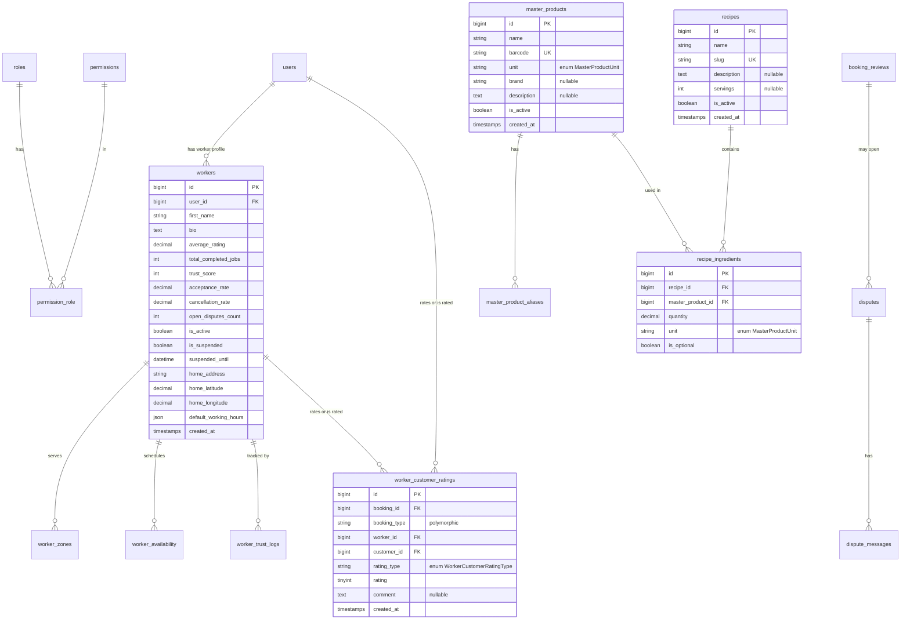

# Shared Tables ERD Plan

## Purpose

This file defines shared tables used by multiple modules. Module-specific tables live only in:

- `restaurant_system_erd_c43e2031.plan.md`
- `cleaning_service_erd_231c9672.plan.md`
- `supermarket_system_erd.plan.md`

## Excluded Scope

The following are intentionally excluded from active ERD coverage:

- delivery flows and delivery dispatch tables
- wallet and wallet ledger tables
- social integration features
- heatmap-specific analytics schemas

## Tier 1 - Global shared tables

| Table                    | Notes                                                            |
| ------------------------ | ---------------------------------------------------------------- |
| `users`                  | Existing Laravel user table                                      |
| `media`                  | Spatie MediaLibrary polymorphic table                            |
| `notifications`          | Laravel notifications table                                      |
| `personal_access_tokens` | Sanctum tokens                                                   |
| `roles`                  | Platform-level RBAC roles (`is_system` flag)                     |
| `permissions`            | Global permissions                                               |
| `permission_role`        | Pivot between `roles` and `permissions`                          |
| `cancellation_policies`  | Module-scoped policies (`restaurant`, `cleaning`, `supermarket`) |

## Tier 2 - Shared worker-service tables (Cleaning domain)

| Table                   | Notes                                        |
| ----------------------- | -------------------------------------------- |
| `workers`               | Worker profile and KPIs                      |
| `worker_zones`          | Preferred work areas (polygon support)       |
| `worker_availability`   | Availability calendar                        |
| `worker_trust_logs`     | Trust score audit log                        |
| `property_type_configs` | Guided-estimation lookup                     |
| `service_addons`        | Shared add-ons for cleaning-related bookings |
| `travel_cost_configs`   | Travel compensation rules                    |

## Tier 3 - Shared catalog and recipe tables (Restaurant + Supermarket)

| Table                    | Notes                                                |
| ------------------------ | ---------------------------------------------------- |
| `master_products`        | Canonical product catalog (barcode, unit, metadata)  |
| `master_product_aliases` | Alternate names/search aliases for `master_products` |
| `recipes`                | Recipe header entities                               |
| `recipe_ingredients`     | Recipe to product mapping with quantity/unit         |

## Tier 4 - Shared booking protocol tables (Cleaning)

| Table                    | Notes                                  |
| ------------------------ | -------------------------------------- |
| `booking_reviews`        | Polymorphic booking reviews            |
| `booking_status_logs`    | Polymorphic booking status transitions |
| `booking_security_codes` | Polymorphic mutual security codes      |
| `booking_extensions`     | Polymorphic extension requests         |
| `disputes`               | Polymorphic dispute headers            |
| `dispute_messages`       | Dispute thread messages                |
| `sos_alerts`             | Polymorphic emergency alerts           |
| `system_alerts`          | Polymorphic system anomaly alerts      |

## Tier 5 - Shared bidirectional rating table

| Table                     | Notes                                                                    |
| ------------------------- | ------------------------------------------------------------------------ |
| `worker_customer_ratings` | Worker rates customer and customer rates worker; tied to booking context |

## ERD Diagram (shared entities)

## Shared Enums (`app/Enums/`)

| Enum                         | Cases                                                                                                                                                |
| ---------------------------- | ---------------------------------------------------------------------------------------------------------------------------------------------------- |
| `PropertyType`               | `Studio`, `Apartment`, `Villa`, `Office`                                                                                                             |
| `LivingRoomSize`             | `Small`, `Medium`, `Large`                                                                                                                           |
| `GenderPreference`           | `Male`, `Female`, `Any`                                                                                                                              |
| `PermissionGroup`            | `Orders`, `Products`, `Inventory`, `Offers`, `Staff`, `Reports`, `Settings`, `Bookings`, `Workers`, `Disputes`, `SystemAlerts`, `Pricing`, `Catalog` |
| `AvailabilityType`           | `Available`, `Blocked`, `Vacation`                                                                                                                   |
| `ExtensionStatus`            | `Pending`, `Approved`, `Rejected`                                                                                                                    |
| `DisputeCategory`            | `PoorQuality`, `PropertyDamage`, `Unprofessional`, `BillingIssue`, `Other`                                                                           |
| `DisputeStatus`              | `Open`, `UnderReview`, `Resolved`, `Closed`                                                                                                          |
| `DisputeResolution`          | `FullRefund`, `PartialRefund`, `WorkerPenalty`, `Dismissed`                                                                                          |
| `EmergencyType`              | `SafetyThreat`, `MedicalEmergency`, `SevereConflict`                                                                                                 |
| `SOSStatus`                  | `Triggered`, `Acknowledged`, `Resolved`                                                                                                              |
| `AlertType`                  | `DelayedRating`, `FrozenGPS`, `SOSTriggered`, `TimeExpired`, `OverdueCompletion`, `AnomalyDetected`                                                  |
| `AlertSeverity`              | `Low`, `Medium`, `High`, `Critical`                                                                                                                  |
| `SystemAlertStatus`          | `New`, `Acknowledged`, `Resolved`                                                                                                                    |
| `DistanceMode`               | `CurrentLocation`, `HomeAddress`, `SmartAutomatic`                                                                                                   |
| `MasterProductUnit`          | `Piece`, `Gram`, `Kilogram`, `Milliliter`, `Liter`, `Pack`                                                                                           |
| `DocumentVerificationStatus` | `Pending`, `Approved`, `Rejected`                                                                                                                    |
| `WorkerCustomerRatingType`   | `WorkerToCustomer`, `CustomerToWorker`                                                                                                               |

## Polymorphic `booking_type` morph map

| Alias              | Model                                        |
| ------------------ | -------------------------------------------- |
| `cleaning_booking` | `Modules\\Cleaning\\Models\\CleaningBooking` |
| `event_booking`    | `Modules\\Cleaning\\Models\\EventBooking`    |

## Key Indexes (shared)

- `roles`: unique on `slug`, index on `is_system`
- `permissions`: unique on `slug`
- `permission_role`: unique on `permission_id` + `role_id`
- `cancellation_policies`: index on `module`, `is_active`, `is_default`
- `workers`: unique on `user_id`, index on `is_active`, `trust_score`
- `worker_zones`: index on `worker_id`, `is_active`
- `worker_availability`: index on `worker_id`, `availability_date`
- `worker_trust_logs`: index on `worker_id`, `created_at`
- `master_products`: unique on `barcode`, index on `name`
- `master_product_aliases`: index on `master_product_id`, `alias`
- `recipes`: unique on `slug`, index on `is_active`
- `recipe_ingredients`: index on `recipe_id`, `master_product_id`
- `booking_reviews`: unique on `booking_id` + `booking_type` + `customer_id`
- `booking_status_logs`: index on `booking_id`, `booking_type`
- `booking_security_codes`: index on `booking_id`, `booking_type`
- `booking_extensions`: index on `booking_id`, `booking_type`, `status`
- `disputes`: unique on `ticket_number`, index on `booking_id`, `booking_type`, `status`
- `dispute_messages`: index on `dispute_id`, `created_at`
- `sos_alerts`: index on `booking_id`, `booking_type`, `status`
- `system_alerts`: index on `booking_type`, `status`, `alert_type`
- `worker_customer_ratings`: unique on `booking_id` + `booking_type` + `rating_type`

## Module dependency summary

- **Restaurant module:** uses `users`, RBAC shared tables, cancellation policies, shared catalog/recipe tables.
- **Supermarket module:** uses `users`, RBAC shared tables, cancellation policies, shared catalog/recipe tables.
- **Cleaning module:** uses `users`, cancellation policies, worker infrastructure, travel/add-on config, booking protocol tables, and `worker_customer_ratings`.

