# Supermarket System Module ERD Plan

## Architecture Context

This module is a grocery and marketplace product-commerce system, not a worker-service booking domain.

## Excluded Scope

The following are intentionally excluded from active ERD coverage:

- delivery flows and delivery tracking schemas
- wallet schemas
- social integration features (group ordering, voting, lucky-box)
- heatmap/coverage analytics schemas

## Shared tables

This module depends on shared tables from `shared_tables_erd.plan.md`:

- global: `users`, `roles`, `permissions`, `permission_role`, `cancellation_policies`
- catalog/recipe: `master_products`, `master_product_aliases`, `recipes`, `recipe_ingredients`

## ERD Diagram

```mermaid
erDiagram
    users ||--o{ sm_stores : "owns"
    users ||--o{ sm_carts : "has"
    users ||--o{ sm_orders : "places"
    users ||--o{ sm_smart_lists : "creates"
    users ||--o{ sm_recurring_orders : "schedules"
    users ||--o{ sm_assistant_queries : "submits"
    users ||--o{ sm_order_disputes : "opens"

    roles ||--o{ permission_role : "has"
    permissions ||--o{ permission_role : "in"
    cancellation_policies ||--o{ sm_orders : "governs"

    master_products ||--o{ master_product_aliases : "has"
    master_products ||--o{ sm_products : "canonical link"
    master_products ||--o{ recipe_ingredients : "used in"
    recipes ||--o{ recipe_ingredients : "contains"
    recipes ||--o{ sm_assistant_queries : "matched"

    sm_stores ||--o{ sm_store_hours : "has"
    sm_stores ||--o{ sm_categories : "organizes"
    sm_stores ||--o{ sm_products : "sells"
    sm_stores ||--o{ sm_offers : "runs"
    sm_stores ||--o{ sm_coupons : "issues"
    sm_stores ||--o{ sm_orders : "receives"
    sm_stores ||--o{ sm_store_documents : "has"
    sm_stores ||--o{ sm_store_trust_logs : "tracked by"
    sm_stores ||--o{ sm_store_daily_stats : "has"
    sm_stores ||--o{ sm_commission_rules : "uses"
    sm_stores ||--o{ sm_lost_opportunities : "lost sales"

    sm_categories ||--o{ sm_products : "contains"
    sm_products }o--o{ sm_offers : "included in"
    sm_products ||--o{ sm_lost_opportunities : "stock shortfall"

    sm_carts ||--o{ sm_cart_items : "contains"
    sm_orders ||--o{ sm_order_items : "contains"
    sm_orders ||--o{ sm_order_status_logs : "status history"
    sm_orders ||--o{ sm_order_disputes : "disputed by"
    sm_order_disputes ||--o{ sm_order_dispute_messages : "has"

    sm_smart_lists ||--o{ sm_smart_list_items : "contains"
    sm_recurring_orders ||--o{ sm_recurring_order_items : "contains"

    sm_stores {
        bigint id PK
        bigint owner_user_id FK
        string name
        string slug UK
        text description
        string address
        decimal latitude
        decimal longitude
        string phone
        string email
        decimal average_rating
        int total_reviews
        int trust_score
        int warning_count
        boolean is_active
        boolean is_featured
        datetime suspension_until "nullable"
        timestamps created_at
    }

    sm_products {
        bigint id PK
        bigint store_id FK
        bigint category_id FK
        bigint master_product_id FK "nullable"
        string name
        string barcode "nullable"
        string source_type "enum SmProductSource"
        text description "nullable"
        decimal price
        decimal discounted_price "nullable"
        int stock_quantity
        int low_stock_threshold
        datetime expires_at "nullable"
        boolean is_available
        timestamps created_at
    }

    sm_orders {
        bigint id PK
        bigint customer_id FK
        bigint store_id FK
        bigint coupon_id FK "nullable"
        bigint cancellation_policy_id FK "nullable"
        string order_number UK
        string status "enum SmOrderStatus"
        string pickup_mode "enum SmPickupMode"
        datetime pickup_scheduled_for "nullable"
        datetime ready_for_pickup_at "nullable"
        datetime picked_up_at "nullable"
        datetime customer_pickup_confirmed_at "nullable"
        decimal subtotal
        decimal discount_amount
        decimal service_fee
        decimal total_amount
        decimal cancellation_fee_amount "nullable"
        json cancellation_policy_snapshot "nullable"
        text special_instructions "nullable"
        datetime cancelled_at "nullable"
        text cancellation_reason "nullable"
        timestamps created_at
    }

    sm_lost_opportunities {
        bigint id PK
        bigint store_id FK
        bigint product_id FK
        bigint customer_id FK "nullable"
        int attempted_quantity
        int available_stock
        timestamps created_at
    }

    users {
        bigint id PK
        string name
        string email UK
        timestamps created_at
    }

    roles {
        bigint id PK
        string name
        string slug UK
        boolean is_system
        timestamps created_at
    }

    permissions {
        bigint id PK
        string name
        string slug UK
        string group "nullable"
        timestamps created_at
    }

    permission_role {
        bigint permission_id FK
        bigint role_id FK
    }

    cancellation_policies {
        bigint id PK
        string module "restaurant|cleaning|supermarket"
        string name
        text description "nullable"
        json rules
        boolean is_active
        boolean is_default
        timestamps created_at
    }

    master_products {
        bigint id PK
        string name
        string barcode UK
        string unit "enum MasterProductUnit"
        string brand "nullable"
        text description "nullable"
        boolean is_active
        timestamps created_at
    }

    master_product_aliases {
        bigint id PK
        bigint master_product_id FK
        string alias
        timestamps created_at
    }

    recipes {
        bigint id PK
        string name
        string slug UK
        text description "nullable"
        int servings "nullable"
        boolean is_active
        timestamps created_at
    }

    recipe_ingredients {
        bigint id PK
        bigint recipe_id FK
        bigint master_product_id FK
        decimal quantity
        string unit "enum MasterProductUnit"
        boolean is_optional
    }
```

## Entities Summary (module tables)

### Merchant and catalog entities

- `sm_stores`
- `sm_store_hours`
- `sm_categories`
- `sm_products`
- `sm_store_documents`
- `sm_store_trust_logs`
- `sm_store_daily_stats`
- `sm_commission_rules`
- `sm_lost_opportunities`

### Promotion and inventory entities

- `sm_inventory_logs`
- `sm_offers`
- `sm_offer_products`
- `sm_coupons`

### Cart and order entities

- `sm_carts`
- `sm_cart_items`
- `sm_orders`
- `sm_order_items`
- `sm_order_status_logs`
- `sm_order_disputes`
- `sm_order_dispute_messages`

### Smart assistant and repeat shopping entities

- `sm_assistant_queries`
- `sm_smart_lists`
- `sm_smart_list_items`
- `sm_recurring_orders`
- `sm_recurring_order_items`

## Removed legacy service-booking tables

The following legacy tables are explicitly removed from this module plan:

- `sm_guided_questions`
- `sm_guided_question_options`
- `sm_bookings`
- `sm_booking_services`
- `sm_booking_addons`
- `sm_event_bookings`
- `sm_event_booking_services`
- `sm_event_booking_workers`
- `sm_arrival_trackings`
- `sm_service_checklist_items`
- `sm_booking_checklist_progress`
- `sm_time_warnings`
- `sm_coverage_zones`
- `sm_zone_daily_stats`

## Important Interface / Type Additions

- `SmOrderStatus`: `Pending`, `Accepted`, `Preparing`, `ReadyForPickup`, `Completed`, `Cancelled`
- `SmPickupMode`: `ImmediatePickup`, `ScheduledPickup`
- `SmAssistantInputMode`: `Text`, `Voice`
- `SmDisputeStatus`: `Open`, `UnderReview`, `Resolved`, `Closed`
- `SmCommissionType`: `Percentage`, `Fixed`
- `SmProductSource`: `BarcodeScan`, `CatalogSearch`, `Manual`, `Template`, `BulkImport`
- `SmRecurringOrderStatus`: `Active`, `Paused`, `Cancelled`
- `SmDocumentType`: `Identity`, `CommercialRegistration`, `HealthCertificate`, `Other`

## Key Indexes

- `sm_stores`: unique on `slug`, index on `owner_user_id`, `is_active`, `trust_score`
- `sm_store_hours`: index on `store_id`, `day_of_week`
- `sm_categories`: index on `store_id`, `sort_order`, unique on `store_id` + `slug`
- `sm_products`: index on `store_id` + `is_available`, `category_id`, `master_product_id`, `barcode`
- `sm_inventory_logs`: index on `product_id`, `type`, `created_at`
- `sm_offers`: index on `store_id`, `is_active`, `starts_at`, `ends_at`
- `sm_offer_products`: unique on `offer_id` + `product_id`
- `sm_coupons`: unique on `code`, index on `store_id`, `is_active`, `starts_at`, `ends_at`
- `sm_carts`: unique on `user_id` + `store_id`
- `sm_cart_items`: index on `cart_id`, `product_id`
- `sm_orders`: unique on `order_number`, index on `customer_id` + `status`, `store_id` + `status`, `pickup_scheduled_for`
- `sm_order_items`: index on `order_id`, `product_id`
- `sm_order_status_logs`: index on `order_id`, `created_at`
- `sm_order_disputes`: unique on `ticket_number`, index on `order_id`, `status`
- `sm_order_dispute_messages`: index on `dispute_id`, `created_at`
- `sm_store_documents`: index on `store_id`, `document_type`, `verification_status`
- `sm_store_trust_logs`: index on `store_id`, `created_at`
- `sm_store_daily_stats`: unique on `store_id` + `date`
- `sm_assistant_queries`: index on `user_id`, `store_id`, `created_at`, `matched_recipe_id`
- `sm_smart_lists`: index on `user_id`, `is_active`
- `sm_smart_list_items`: index on `smart_list_id`, `master_product_id`
- `sm_recurring_orders`: index on `user_id`, `status`, `next_run_at`
- `sm_recurring_order_items`: index on `recurring_order_id`, `master_product_id`
- `sm_commission_rules`: index on `store_id`, `is_active`, `is_default`

## Requirement-to-Table Mapping (non-excluded)

- Smart assistant (voice/text, recipe-aware): `sm_assistant_queries` + shared `recipes` and `recipe_ingredients`
- Store browsing and filtering: `sm_stores`, `sm_categories`, `sm_store_hours`
- Nearby deals and promo logic persistence: `sm_offers`, `sm_offer_products`, `sm_coupons`
- Product comparison and barcode base: `sm_products`, shared `master_products`, shared `master_product_aliases`
- Smart lists and one-click reorder: `sm_smart_lists`, `sm_smart_list_items`
- Recurring scheduled orders: `sm_recurring_orders`, `sm_recurring_order_items`
- Cart and checkout: `sm_carts`, `sm_cart_items`, `sm_orders`, `sm_order_items`
- Pickup lifecycle and confirmation: pickup fields in `sm_orders`, `sm_order_status_logs`
- Disputes and resolution: `sm_order_disputes`, `sm_order_dispute_messages`
- Merchant product management paths (barcode/catalog/manual/bulk): `sm_products.source_type`, optional `master_product_id`, `sm_inventory_logs`
- Store trust and governance: `sm_store_trust_logs`, `sm_stores.trust_score`, `sm_store_documents`
- Non-heatmap analytics snapshots: `sm_store_daily_stats`

## Notes

- Recommendation ranking logic is service-layer logic; ERD stores query and durable operational state.
- Notifications use shared Laravel `notifications` table.

