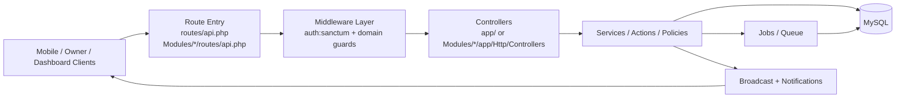
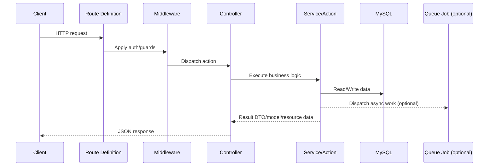
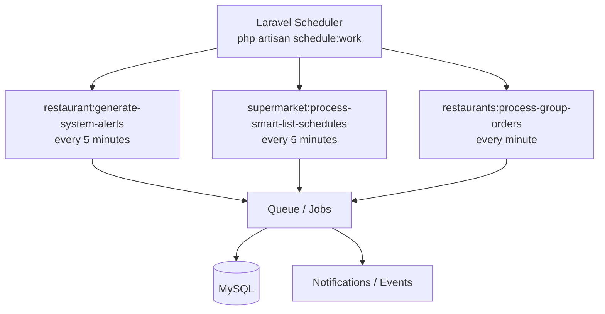

# Dllni Backend

Flow-first backend guide for developers joining the Dllni project.

This repository is the backend only (`Dllni_backend`). Mobile and owner apps live in sibling repositories.

## Stack and Scope

- PHP 8.4
- Laravel 12
- Laravel Sanctum token authentication
- `nwidart/laravel-modules` modular monolith structure
- MySQL (default)
- Queue + scheduler for async processing
- Vite for admin/frontend assets

Core domains served by this backend:

- User app APIs (`/api/v1/user/...`)
- Restaurant management and owner APIs
- Supermarket management and owner APIs
- Cleaning services and worker APIs
- Shared services (auth, notifications, deep links, disputes, workers, alerts)

## Domain Map

| Domain | Main Module | Primary Route Entry | Notes |
| --- | --- | --- | --- |
| User app | `Modules/User` | `Modules/User/routes/api.php` (`/api/v1/user/...`) | Public + authenticated user flows, carts, orders, group votes/orders |
| Restaurants | `Modules/Resturants` | `Modules/Resturants/routes/api.php` (`/api/v1/...`) | Restaurant owner operations, products, offers, analytics |
| Supermarket | `Modules/Supermarket` | `Modules/Supermarket/routes/api.php` (`/api/v1/...`) | Store owner, inventory, orders, smart lists, reports |
| Cleaning | `Modules/Cleaning` | `Modules/Cleaning/routes/api.php` (`/api/v1/...`) | Cleaning bookings, worker profile, billing policies |
| Shared platform | `app/` + `routes/api.php` | `routes/api.php` | Auth, deep links, disputes, notifications, workers |

## Project Flow Diagram



## Request Lifecycle (How to Trace Any Endpoint)



## Async and Scheduled Flows



These schedules are defined in `routes/console.php`.

## Where to Edit (Code Navigation)

Start here based on the change type:

- Shared API behavior: `routes/api.php`, `app/Http/Controllers`, `app/Services`
- User flows: `Modules/User/app/*`
- Restaurant flows: `Modules/Resturants/app/*`
- Supermarket flows: `Modules/Supermarket/app/*`
- Cleaning flows: `Modules/Cleaning/app/*`
- Scheduled/command behavior: `routes/console.php` and `app/Console/Commands`
- Database schema: `database/migrations` and `Modules/*/database/migrations`
- Feature tests: `tests/Feature` + module test locations

Practical endpoint tracing pattern:

1. Find route in `routes/api.php` or `Modules/*/routes/api.php`.
2. Open mapped controller.
3. Follow service/action class calls.
4. Check model, policy, and request validation.
5. Confirm response resource/transformer.

## Local Setup (Backend Only)

From `Dllni_backend`:

```bash
composer install
cp .env.example .env
php artisan key:generate
php artisan migrate
npm install
```

Minimum `.env` values:

- `APP_URL`
- `DB_HOST`, `DB_PORT`, `DB_DATABASE`, `DB_USERNAME`, `DB_PASSWORD`
- `QUEUE_CONNECTION` (default is `database`)
- `BROADCAST_CONNECTION` and `PUSHER_*` for realtime flows

Run development stack:

```bash
composer dev
```

`composer dev` runs:

- Laravel API server
- Queue listener
- Laravel Pail logs
- Vite dev server

Backend default URL: `http://127.0.0.1:8000`

If you need scheduler-driven behavior locally, run:

```bash
php artisan schedule:work
```

## New Developer Onboarding Checklist

1. Boot the project with the setup commands above.
2. Run `php artisan route:list` and inspect route prefixes for your target domain.
3. Read one domain contract from `docs/` and trace one endpoint route -> controller -> service -> model.
4. Run quality/test commands before pushing:
   - `composer test`
   - `composer lint`
5. For realtime or scheduled features, run both queue listener and scheduler locally.

## Documentation for New Developers

Use this docs map to get productive quickly:

### Foundation

- `docs/API_CONTRACT_AUTH.md` - authentication and token contracts
- `docs/API_CONTRACT_V1_DEEP_LINKS.md` - deep link resolution/open tracking
- `docs/API_CONTRACT_V1_USER_NOTIFICATIONS.md` - unified notification APIs

### User App

- `docs/API_CONTRACT_USER_ORDERS_AND_CART.md` - user ordering and cart flows
- `docs/API_CONTRACT_RESTAURANTS.md` - user-facing restaurant APIs
- `docs/API_CONTRACT_USER_SUPERMARKET_SHOPPING_LISTS.md` - shopping list flows
- `docs/FLUTTER_RESTAURANT_GROUP_ORDERING_API_CONTRACT.md` - full group-ordering contract for Flutter

### Restaurant Owner

- `docs/API_CONTRACT_RESTAURANT_OWNER_APP.md`
- `docs/API_CONTRACT_RESTAURANTS_DASHBOARD.md`

### Supermarket Owner

- `docs/API_CONTRACT_SUPERMARKET_OWNER.md`
- `docs/API_CONTRACT_SUPERMARKET_ADMIN.md`

### Cleaning

- `docs/API_CONTRACT_CLEANING_WORKER.md`
- `docs/API_CONTRACT_CLEANING_DASHBOARD.md`
- `docs/API_CONTRACT_USER_CLEANING_REALTIME_GATES.md`

### QA and Flow Verification

- `docs/CLEANING_ENDPOINT_FLOWS_AND_PLAYWRIGHT_QA_PLAN.md`
- `docs/PLAYWRIGHT_QA_RESTAURANT_FLOWS_USER_OWNER_APPS.md`
- `docs/FLUTTER_SUPERMARKET_ENDPOINT_FLOWS_AND_PLAYWRIGHT_QA.md`

## Useful Commands

```bash
php artisan route:list
php artisan test
composer test
composer lint
npm run build
```
