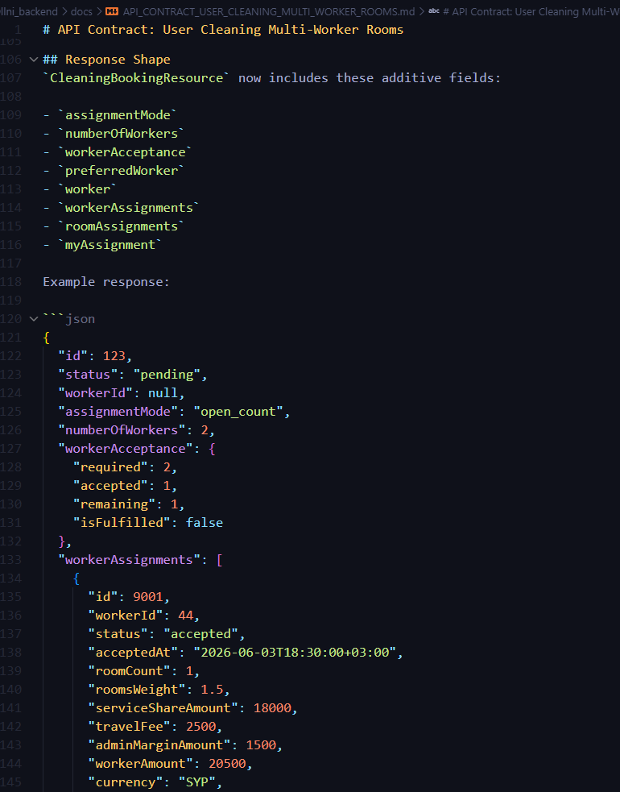

# API Contract: User Cleaning Multi-Worker Rooms

## Scope
This contract covers the multi-worker cleaning flow for the Flutter user app and worker app.

Base path:
- `/api/v1/user/cleaning/orders`
- `/api/v1/cleaning-bookings`

Auth:
- `Authorization: Bearer <token>`
- `Content-Type: application/json`

The backend keeps the existing booking lifecycle. The only state change is that `pending` now also means "searching for workers" while the required team is not yet complete.

---

## Core Rules
- `assignmentMode` values:
  - `preferred_worker`
  - `open_count`
- If `assignmentMode` is omitted, the backend infers it from `preferredWorkerId` and `numberOfWorkers`.
- `preferred_worker` implies one worker only.
- `open_count` means the customer wants a team of `numberOfWorkers`.
- `workerId` stays as the legacy top-level primary worker field.
- `workerId` is only populated once the required team is fulfilled and the booking is finalized to `worker_assigned`.
- `workerAcceptance` and `workerAssignments` are the source of truth for team progress.
- `roomAssignments` are the source of truth for per-room ownership.
- Customer room assignment is allowed before `in_progress`.
- Worker room claim is allowed only after the worker has accepted and while the booking is still `pending`.

---

## Endpoints
### User booking endpoints
- `POST /api/v1/user/cleaning/orders/estimate-price`
- `POST /api/v1/user/cleaning/orders`
- `GET /api/v1/user/cleaning/orders/{order}`
- `PATCH /api/v1/user/cleaning/orders/{order}/room-assignments`

### Worker booking endpoints
- `POST /api/v1/cleaning-bookings/{id}/accept`
- `POST /api/v1/cleaning-bookings/{id}/rooms/claim`
- `POST /api/v1/cleaning-bookings/{id}/reject`

---

## Create / Update Payload
The booking create and update payloads now accept team fields in addition to the existing cleaning fields.

```json
{
  "propertyType": "apartment",
  "propertyDetails": {
    "address": "Damascus, Mazzeh",
    "location_name": "Home",
    "rooms": 4,
    "bedrooms": 1,
    "bathrooms": 1,
    "kitchens": 1,
    "living_room_size": "medium",
    "room_size_breakdown": {
      "bedroom": { "small": 1, "medium": 0, "large": 0 },
      "bathroom": { "small": 1, "medium": 0, "large": 0 },
      "kitchen": { "small": 0, "medium": 1, "large": 0 },
      "living_room": { "small": 0, "medium": 1, "large": 0 },
      "balcony": { "small": 0, "medium": 0, "large": 0 }
    }
  },
  "assignmentMode": "open_count",
  "numberOfWorkers": 2,
  "scheduledDate": "2026-06-05",
  "scheduledTime": "09:00",
  "addressLatitude": 33.5138,
  "addressLongitude": 36.2765,
  "genderPreference": "any",
  "termsAccepted": true
}
```

Preferred-worker example:

```json
{
  "propertyType": "apartment",
  "propertyDetails": {
    "address": "Damascus, Mazzeh",
    "location_name": "Home"
  },
  "assignmentMode": "preferred_worker",
  "preferredWorkerId": 44,
  "numberOfWorkers": 1,
  "scheduledDate": "2026-06-05",
  "scheduledTime": "09:00",
  "termsAccepted": true
}
```

Validation notes:
- `preferredWorkerId` cannot be combined with `numberOfWorkers > 1`.
- `numberOfWorkers` remains bounded by the existing request validation.
- `assignmentMode` is additive; legacy clients can omit it.

---

## Response Shape
`CleaningBookingResource` now includes these additive fields:

- `assignmentMode`
- `numberOfWorkers`
- `workerAcceptance`
- `preferredWorker`
- `worker`
- `workerAssignments`
- `roomAssignments`
- `myAssignment`

Example response:

```json
{
  "id": 123,
  "status": "pending",
  "workerId": null,
  "assignmentMode": "open_count",
  "numberOfWorkers": 2,
  "workerAcceptance": {
    "required": 2,
    "accepted": 1,
    "remaining": 1,
    "isFulfilled": false
  },
  "workerAssignments": [
    {
      "id": 9001,
      "workerId": 44,
      "status": "accepted",
      "acceptedAt": "2026-06-03T18:30:00+03:00",
      "roomCount": 1,
      "roomsWeight": 1.5,
      "serviceShareAmount": 18000,
      "travelFee": 2500,
      "adminMarginAmount": 1500,
      "workerAmount": 20500,
      "currency": "SYP",
      "roomIds": [501],
      "worker": {
        "id": 44,
        "firstName": "Ahmad",
        "name": "Ahmad Ali",
        "phone": "+963...",
        "averageRating": 4.8,
        "totalCompletedJobs": 92,
        "isVerified": true,
        "avatarUrl": null
      }
    }
  ],
  "roomAssignments": [
    {
      "id": 501,
      "roomKey": "bedroom.small.1",
      "roomType": "bedroom",
      "roomSize": "small",
      "displayLabel": "Bedroom 1 - Small",
      "weight": 1.0,
      "assignedWorkerId": 44,
      "assignmentSource": "customer",
      "assignedWorker": {
        "id": 44,
        "firstName": "Ahmad",
        "name": "Ahmad Ali",
        "phone": "+963...",
        "averageRating": 4.8,
        "totalCompletedJobs": 92,
        "isVerified": true,
        "avatarUrl": null
      }
    }
  ],
  "myAssignment": {
    "id": 9001,
    "workerId": 44,
    "status": "accepted",
    "acceptedAt": "2026-06-03T18:30:00+03:00",
    "roomCount": 1,
    "roomsWeight": 1.5,
    "serviceShareAmount": 18000,
    "travelFee": 2500,
    "adminMarginAmount": 1500,
    "workerAmount": 20500,
    "currency": "SYP",
    "roomIds": [501]
  }
}
```

`myAssignment` is resolved from the authenticated worker. For legacy single-worker bookings, it can fall back to a synthetic assignment even when `workerAssignments` is empty.

---

## Room Assignment Flow
### Customer assigns rooms
`PATCH /api/v1/user/cleaning/orders/{order}/room-assignments`

Payload:

```json
{
  "assignments": [
    { "roomId": 501, "workerId": 44 },
    { "roomId": 502, "workerId": 44 },
    { "roomId": 503, "workerId": null }
  ]
}
```

Rules:
- `roomId` must belong to the booking.
- `workerId` must be one of the accepted workers, or `null` to unassign.
- The backend keeps the booking `pending` until the team is fulfilled.
- Once the booking becomes `in_progress`, room reassignment is blocked.

### Worker claims rooms
`POST /api/v1/cleaning-bookings/{id}/rooms/claim`

Payload:

```json
{
  "roomIds": [501, 502]
}
```

Rules:
- The worker must already have an accepted assignment.
- The booking must still be `pending`.
- Only unassigned rooms can be claimed.
- If `roomIds` is omitted, the backend claims all currently unassigned rooms for that worker.

### Worker accepts
`POST /api/v1/cleaning-bookings/{id}/accept`

Payload:

```json
{
  "roomIds": [501, 502]
}
```

Rules:
- `roomIds` is optional.
- If provided, the backend claims those rooms during acceptance.
- If the required worker count is not yet met, the booking stays `pending`.
- When the required count is met, the backend finalizes the booking to `worker_assigned` and auto-balances any remaining unassigned rooms.

---

## State Model
- `pending` means the order is still searching when accepted workers are fewer than required.
- `worker_assigned` means the required team is complete and the booking can move through the existing travel/start/completion lifecycle.
- `worker_id` remains the primary legacy worker pointer.
- Accepted workers are still visible through the booking resource and worker-facing screens while the booking is `pending`.

---

## Flutter Notes
### User app
- Show an assignment mode step after room selection.
- `preferred_worker` mode should reuse the previous-workers UI.
- `open_count` mode should show a worker-count selector.
- Render `pending` + incomplete team as "searching for workers".
- Show accepted workers, remaining slots, and room ownership in order details.
- Send `assignmentMode` and `numberOfWorkers` on create, update, and estimate requests.
- Use `PATCH /room-assignments` for customer room edits.
- Refetch the booking when `cleaning_booking.team_updated` is received.

### Worker app
- Show accepted count, remaining count, and current worker participation on pending bookings.
- Allow room selection on accept, and separate room claiming while the booking is still pending.
- Keep travel/start/completion disabled until the booking is `worker_assigned`.
- Use `workerAmount` from worker assignments for earnings and transactions.
- Refetch the booking when `cleaning_booking.team_updated` is received.

---

## Source of Truth
- `Modules/User/app/Services/UserCleaningOrderService.php`
- `Modules/Cleaning/app/Services/CleaningBookingTeamService.php`
- `Modules/Cleaning/app/Http/Resources/CleaningBookingResource.php`
- `Modules/Cleaning/app/Http/Controllers/API/CleaningBookingController.php`
- `Modules/User/app/Http/Controllers/API/UserCleaningOrderRoomAssignmentsController.php`

