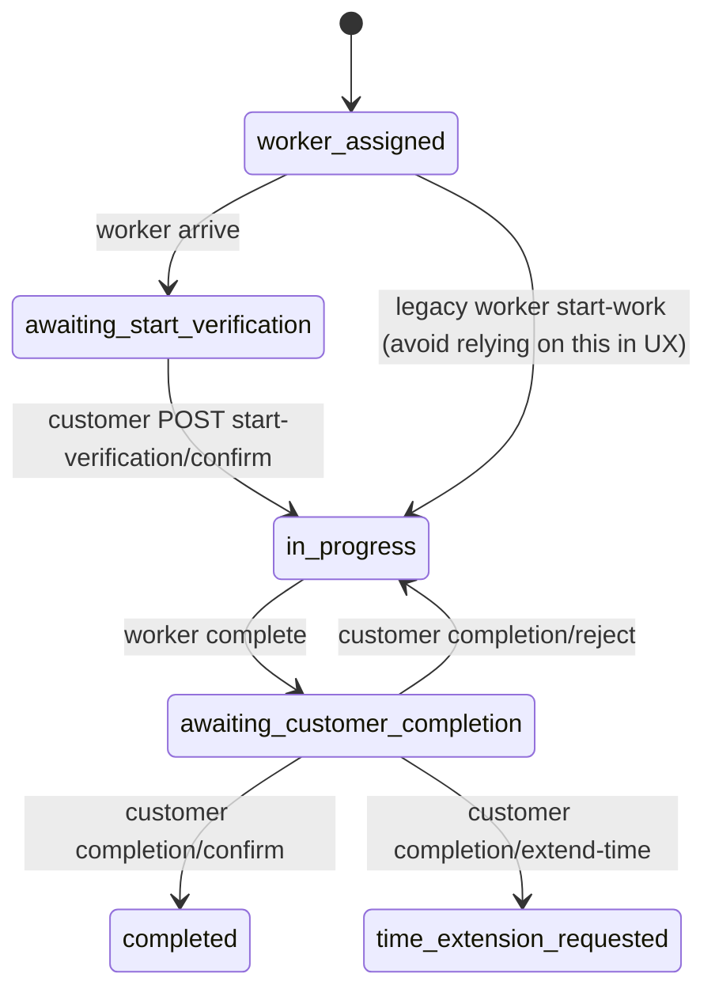

# Flutter implementation guide – cleaning order realtime gates

This file summarizes **what changed** in the backend for cleaning orders and gives **concrete guidance** for implementing the customer (user) Flutter app: REST calls, status-driven UI, Pusher subscriptions, and error handling.

**Related contracts (detail and tables):**

- [API_CONTRACT_USER_CLEANING_REALTIME_GATES.md](API_CONTRACT_USER_CLEANING_REALTIME_GATES.md) – HTTP + Pusher reference  
- [API_CONTRACT_CLEANING_WORKER.md](API_CONTRACT_CLEANING_WORKER.md) – worker app (travel, arrive, security code, complete)  
- [CLEANING_ORDER_FLOW_CHANGES_SUMMARY.md](CLEANING_ORDER_FLOW_CHANGES_SUMMARY.md) – quoting and user order CRUD context  

---

## 1. What changed (product summary)

| Area | Change |
| ---- | ------ |
| **Statuses** | New booking statuses: `awaiting_start_verification`, `awaiting_customer_completion`, `time_extension_requested` (see §3). |
| **Start of work** | After the worker marks **arrived**, the customer must enter a **4-digit** code (shown by the worker from their app). Submitting the code moves the job to **`in_progress`** via a **new user endpoint** (not the old generic “start” on worker only). |
| **Security code** | Worker-only `GET /api/v1/cleaning-bookings/{id}/security-code` returns a **4-digit** string plus **`expiresAt`** (ISO). Each request can issue a **new** code (previous hash is replaced). Server stores a **hash**, not plaintext, for verification. |
| **End of work** | Worker **complete** no longer jumps straight to `completed` for the customer flow. Status becomes **`awaiting_customer_completion`** until the customer **confirms**, **rejects**, or **requests extension** via new user endpoints. |
| **Realtime** | New private-channel events for the two gates (`cleaning_order.awaiting_start_verification`, `cleaning_order.awaiting_customer_completion`) plus **`ArrivalVerified`** and **`CompletionDecisionMade`** (see §6). |
| **Rate limit** | `POST …/start-verification/confirm` is limited to **5 requests per minute per user and per order** (avoid brute force on the code). |

**Legacy note:** The worker app may still call `POST …/start-work` from `worker_assigned` without arrival/code. The **recommended** customer experience assumes: travel → arrive → code → customer confirm → `in_progress`. After customer confirm, the booking is already `in_progress`; do not rely on the worker calling `start-work` again.

---

## 2. Base URLs and auth

- **REST:** `{baseUrl}/api/v1/user/...` (same `baseUrl` as the rest of the user module).  
- **Headers:** `Authorization: Bearer {accessToken}`, `Accept: application/json`, `Content-Type: application/json` for JSON bodies.  
- **Private channels:** `POST {baseUrl}/broadcasting/auth` with the **same** Bearer token; send `channel_name` and `socket_id` as required by Pusher (form body or JSON, depending on your client – match your existing restaurant/supermarket realtime setup if you already have one).

---

## 3. Status model (Flutter state)

Treat `data.status` from `GET /api/v1/user/cleaning/orders/{order}` (or list payload) as the **source of truth** after each HTTP response. Use Pusher events to **prompt a refetch** or patch local state when fields match.

| `status` | Customer-facing idea | Typical UI |
| -------- | -------------------- | ---------- |
| `worker_assigned` | Worker assigned / may be on the way | Map / timeline; optional “preparing” state if `startedTravelAt` is set |
| `awaiting_start_verification` | Worker is on site; **enter 4-digit code** | Full-screen or sheet: numeric input, confirm button; show hint from `WorkerArrived` / gate event |
| `in_progress` | Cleaning in progress | Hide code UI; show in-progress timeline |
| `awaiting_customer_completion` | Worker says finished; **customer must decide** | Actions: Confirm done / Not done / Need more time |
| `time_extension_requested` | Extension requested | Show “waiting for worker/system” (align with your product copy) |
| `completed` | Done | Success / rating flow |

Suggested flow in code: a single `CleaningOrderVm` (or similar) that holds `id`, `status`, timestamps from resource, and derives `showStartCodePanel`, `showCompletionActions`, etc.

---

## 4. REST – new customer endpoints

`{order}` = booking **integer `id`** from the cleaning order resource.

### 4.1 Confirm start (4-digit code)

- **POST** `/api/v1/user/cleaning/orders/{order}/start-verification/confirm`  
- **Body:** `{ "code": "1234" }` – string, exactly four digits.  
- **When:** Only when `status == awaiting_start_verification`.  
- **Success:** `200`, body includes `data` (booking resource) and `message`. Booking becomes `in_progress`.  
- **Errors:**  
  - `422` – validation or `errors.code` (wrong/expired/not waiting).  
  - `429` – too many attempts (handle with a user-visible cooldown; response may not be standard `errors` JSON).  
- **Idempotent:** If the code was already consumed, server returns **200** with current booking – your UI can treat “already verified” as success and close the sheet.

**Flutter tips**

- Use a `TextFormField` / `PinCodeTextField` with `keyboardType: TextInputType.number`, `maxLength: 4`, and restrict input to digits.  
- Debounce is **not** a substitute for the server rate limit; avoid auto-submitting on every digit past 4.  
- On `429`, disable submit for ~60 seconds or until user navigates away.

### 4.2 Completion gate

| Action | Method | Path | Body |
| ------ | ------ | ---- | ---- |
| Confirm work is OK | POST | `.../completion/confirm` | `{}` optional |
| Reject (“not finished”) | POST | `.../completion/reject` | `{ "reason": "..." }` optional, max 500 chars |
| Request more time | POST | `.../completion/extend-time` | `{ "additionalMinutes": 30 }` optional, 1–480 |

**When:** Only when `status == awaiting_customer_completion`.

**Success:** `200` + `data` with updated `status` (`completed`, `in_progress`, or `time_extension_requested`).

**Errors:** `422` with `errors.status` or field errors if not in the right state.

---

## 5. Refetch strategy

Minimum viable approach:

1. On order details screen **init**: subscribe to `private-cleaning-booking.{id}` (see §6).  
2. On **any** listed realtime event for that booking: call `GET /api/v1/user/cleaning/orders/{id}` and replace local model (simplest, avoids drift).  
3. After **each** successful POST in §4: use response `data` directly (no extra GET required).

Optimisation (optional): merge `CleaningBookingTrackingUpdated.tracking` into local state without a full GET; only do this if you map every key carefully and handle nulls.

---

## 6. Pusher / Echo (Flutter)

### 6.1 Channel names

| Purpose | Subscribe name (Pusher) |
| ------- | ------------------------ |
| Booking timeline + gates | `private-cleaning-booking.{bookingId}` |

`bookingId` is the same as order `id`.

Authorisation: Laravel private channels use the name **`private-cleaning-booking.{id}`** in the auth request’s `channel_name` field.

### 6.2 Events to bind

Listen on the private booking channel for **all** of the following (names are exact string event names):

| Event name | Use on customer app |
| ---------- | --------------------- |
| `CleaningBookingTrackingUpdated` | Generic status/timestamp refresh |
| `WorkerLocationUpdated` | Map pin updates |
| `WorkerArrived` | Optional banner before code UI |
| `cleaning_order.awaiting_start_verification` | Show **enter code** UI; optional use of `expiresAt` for countdown |
| `cleaning_order.awaiting_customer_completion` | Show **completion** actions; optional `expiresAt` hint |
| `ArrivalVerified` | Close code UI, confirm `in_progress` (still refetch or merge tracking) |
| `CompletionDecisionMade` | If you allow multi-device, sync completion decision; `decision` is `approved` \| `rejected` \| `extension_requested` |

**Packages:** Many teams use `pusher_channels_flutter` or `laravel_echo` + `pusher_client` depending on the rest of the app. Reuse the same auth endpoint and cluster configuration as other modules if already present.

**Dot-prefixed event names:** Names like `cleaning_order.awaiting_start_verification` are valid Pusher event names; ensure your client’s listener matches the string **exactly** (some wrappers default to a namespace – disable or align with Laravel’s `broadcastAs`).

---

## 7. UI checklist (Flutter screens)

- [ ] **Order tracking / detail** – Subscribe when `bookingId` known; unsubscribe on dispose / leave screen.  
- [ ] **`awaiting_start_verification`** – Code entry UI; loading on submit; map `422`/`429` to strings.  
- [ ] **`awaiting_customer_completion`** – Three primary actions (confirm / reject / extend); confirm destructive flows (e.g. reject) with a dialog.  
- [ ] **Empty states** – If user opens code screen but status is no longer `awaiting_start_verification`, show “already started” and refetch.  
- [ ] **Accessibility** – 4-digit field: screen reader labels, error text from `errors.code` when present.  
- [ ] **Deep links** – If you open order by push notification, refetch order before showing gate UI (status may have changed).

---

## 8. Error handling quick reference

| HTTP | Meaning (typical) | Flutter handling |
| ---- | ----------------- | ---------------- |
| 200 | OK | Update `data` from JSON |
| 404 | Order not found or not owned | Pop route or show error |
| 422 | Validation / wrong state / wrong code | Show field or `errors.status` |
| 429 | Start-code throttling / too many attempts | Cooldown UI |

Parse Laravel validation shape: `errors` is a map of field → list of strings.

---

## 9. QA scenarios (manual)

1. Happy path: assigned → travel → arrive → customer sees gate → worker shows code → customer enters correct code → `in_progress`.  
2. Wrong code three times then correct (expect possible `429` if backend threshold exceeded).  
3. Expired code: wait past worker’s `expiresAt`, enter old code → expect `422`, worker refreshes code.  
4. Worker completes → customer sees completion gate → confirm → `completed`.  
5. Customer rejects completion → back to `in_progress`, `workFinishedAt` cleared on refetch.  
6. Customer requests extension → `time_extension_requested`.  
7. Background: second device receives `CompletionDecisionMade` / tracking update after action on first device.

---

## 10. Copy / localization

Server `message` strings on success endpoints are **translated** by the backend (`__()`). Do not hardcode English success text if you display `message` to the user. Validation messages may also be localized depending on `Accept-Language` / app locale configuration on the API.

---

## 11. Files on the backend (for reference only)

Flutter devs usually do not need these paths; they are listed so you can trace behaviour with the mobile team.

- Routes: `Modules/User/routes/api.php` (cleaning order action routes)  
- Controllers: `Modules/User/app/Http/Controllers/API/UserCleaningOrder*Controller.php`  
- Service logic: `Modules/User/app/Services/UserCleaningOrderService.php`  
- Worker lifecycle + code issuance: `Modules/Cleaning/app/Services/CleaningBookingService.php`  
- Events: `Modules/Cleaning/app/Events/*.php`  
- Rate limiter: `app/Providers/AppServiceProvider.php` (`cleaning-start-verification`)

---

_End of guide._
